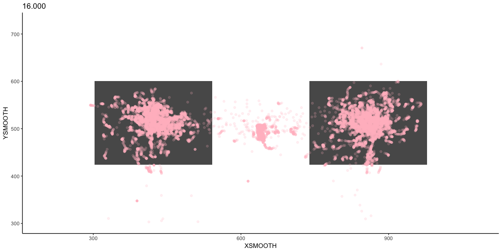
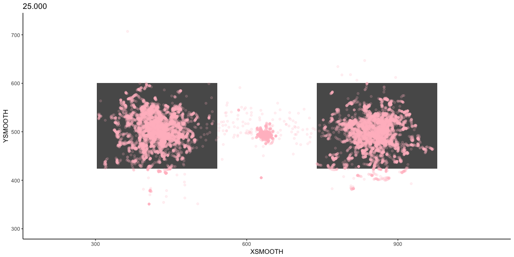
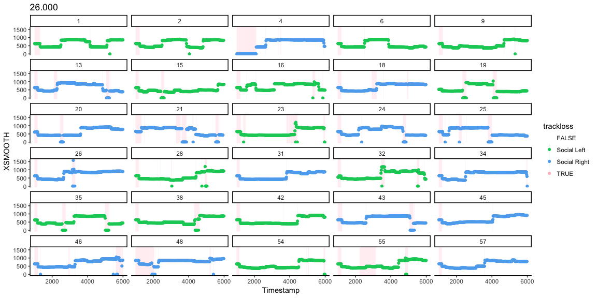
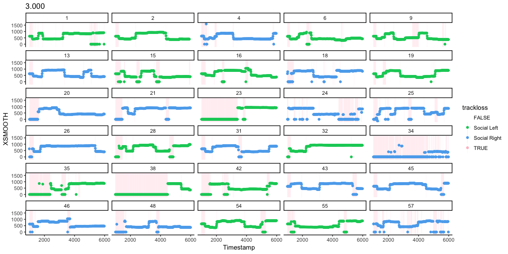
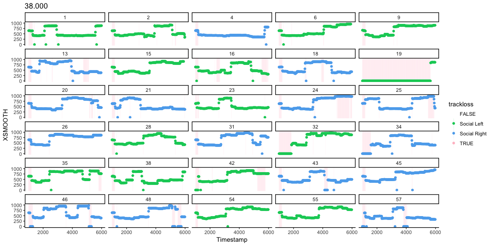
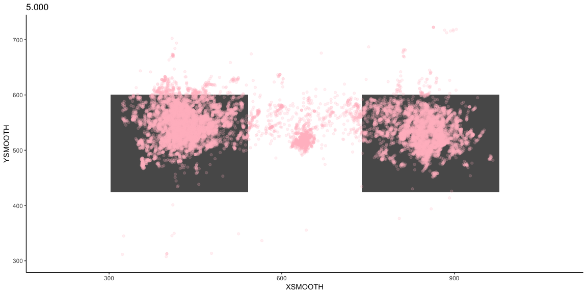

```r
library(drake)
plot_env=readd(PLOT)

plist=ls(plot_env)[str_detect(ls(plot_env), 'XPLOT')]
plist2=ls(plot_env)[str_detect(ls(plot_env), 'XYPLOT')]

for (i in 1:length(plist)){
print(get(plist[i],plot_env))
print(get(plist2[i],plot_env))
}
```

<!-- -->

```
## Warning: Removed 2176 rows containing missing values (geom_point).
```

<!-- --><!-- -->

```
## Warning: Removed 2864 rows containing missing values (geom_point).
```

<!-- --><!-- -->

```
## Warning: Removed 855 rows containing missing values (geom_point).
```

<!-- --><!-- -->

```
## Warning: Removed 1552 rows containing missing values (geom_point).
```

<!-- --><!-- -->

```
## Warning: Removed 810 rows containing missing values (geom_point).
```

<!-- --><!-- -->

```
## Warning: Removed 1890 rows containing missing values (geom_point).
```

<!-- --><!-- -->

```
## Warning: Removed 1108 rows containing missing values (geom_point).
```

<!-- --><!-- -->

```
## Warning: Removed 1688 rows containing missing values (geom_point).
```

<!-- --><!-- -->

```
## Warning: Removed 2465 rows containing missing values (geom_point).
```

<!-- --><!-- -->

```
## Warning: Removed 6875 rows containing missing values (geom_point).
```

<!-- --><!-- -->

```
## Warning: Removed 665 rows containing missing values (geom_point).
```

<!-- --><!-- -->

```
## Warning: Removed 3550 rows containing missing values (geom_point).
```

<!-- --><!-- -->

```
## Warning: Removed 820 rows containing missing values (geom_point).
```

<!-- --><!-- -->

```
## Warning: Removed 311 rows containing missing values (geom_point).
```

<!-- --><!-- -->

```
## Warning: Removed 2740 rows containing missing values (geom_point).
```

<!-- --><!-- -->

```
## Warning: Removed 1539 rows containing missing values (geom_point).
```

<!-- --><!-- -->

```
## Warning: Removed 2301 rows containing missing values (geom_point).
```

<!-- --><!-- -->

```
## Warning: Removed 1751 rows containing missing values (geom_point).
```

<!-- --><!-- -->

```
## Warning: Removed 577 rows containing missing values (geom_point).
```

<!-- --><!-- -->

```
## Warning: Removed 1346 rows containing missing values (geom_point).
```

<!-- --><!-- -->

```
## Warning: Removed 793 rows containing missing values (geom_point).
```

<!-- --><!-- -->

```
## Warning: Removed 1718 rows containing missing values (geom_point).
```

<!-- --><!-- -->

```
## Warning: Removed 2232 rows containing missing values (geom_point).
```

<!-- --><!-- -->

```
## Warning: Removed 657 rows containing missing values (geom_point).
```

<!-- --><!-- -->

```
## Warning: Removed 997 rows containing missing values (geom_point).
```

<!-- --><!-- -->

```
## Warning: Removed 2461 rows containing missing values (geom_point).
```

<!-- --><!-- -->

```
## Warning: Removed 554 rows containing missing values (geom_point).
```

<!-- --><!-- -->

```
## Warning: Removed 4635 rows containing missing values (geom_point).
```

<!-- --><!-- -->

```
## Warning: Removed 101 rows containing missing values (geom_point).
```

<!-- --><!-- -->

```
## Warning: Removed 727 rows containing missing values (geom_point).
```

<!-- --><!-- -->

```
## Warning: Removed 2842 rows containing missing values (geom_point).
```

<!-- --><!-- -->

```
## Warning: Removed 611 rows containing missing values (geom_point).
```

<!-- --><!-- -->

```
## Warning: Removed 605 rows containing missing values (geom_point).
```

<!-- --><!-- -->

```
## Warning: Removed 787 rows containing missing values (geom_point).
```

<!-- --><!-- -->

```
## Warning: Removed 2249 rows containing missing values (geom_point).
```

<!-- --><!-- -->

```
## Warning: Removed 2286 rows containing missing values (geom_point).
```

<!-- --><!-- -->

```
## Warning: Removed 1358 rows containing missing values (geom_point).
```

<!-- --><!-- -->

```
## Warning: Removed 3693 rows containing missing values (geom_point).
```

<!-- --><!-- -->

```
## Warning: Removed 3539 rows containing missing values (geom_point).
```

<!-- --><!-- -->

```
## Warning: Removed 938 rows containing missing values (geom_point).
```

<!-- --><!-- -->

```
## Warning: Removed 996 rows containing missing values (geom_point).
```

<!-- --><!-- -->

```
## Warning: Removed 2040 rows containing missing values (geom_point).
```

<!-- --><!-- -->

```
## Warning: Removed 658 rows containing missing values (geom_point).
```

<!-- --><!-- -->

```
## Warning: Removed 1733 rows containing missing values (geom_point).
```

<!-- --><!-- -->

```
## Warning: Removed 1654 rows containing missing values (geom_point).
```

<!-- --><!-- -->

```
## Warning: Removed 2982 rows containing missing values (geom_point).
```

<!-- --><!-- -->

```
## Warning: Removed 3326 rows containing missing values (geom_point).
```

<!-- -->
