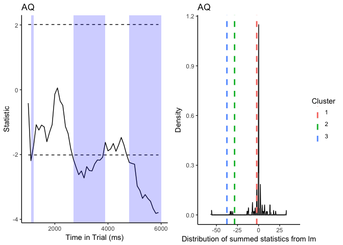
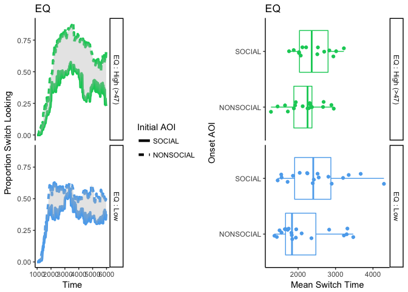

# Index

| Section | Description | Status |
| --- | --- | --- |
| [Initial plot](#plot) | Initial plot of a single observers data |
| [Cleaning](#Cleaning) | Summary of data cleaning |
| [Window](#Window) | Time window analysis |
| [Timeseries](#Timeseries) | Time series analysis |
| [Switching Analysis ](#Switching) | Analysis of switching behavior |

***

<a id='plot'></a>
# Initial plotting.

Summary plot of horizontal gaze position for a single observer.


```r
library(drake)
readd(PLOT)
```

<!-- -->

***

<a id='Cleaning'></a>
# Cleaning summary

### Trackloss Summary.

Proportion trackloss for each observer.


```r
tsummary=readd(CLEANED_FRAME)
tapply(tsummary$trackloss_summary$TracklossForParticipant,tsummary$trackloss_summary$ps,mean)
```

```
##          1          2          3          4          5          6 
## 0.18852368 0.26164994 0.21318865 0.09724618 0.14552737 0.19548287 
##          7          8          9         10         11         12 
## 0.17448207 0.23712775 0.26348340 0.21590909 0.09703114 0.17351598 
##         13         14         15         16         17         18 
## 0.10794569 0.17248860 0.13315535 0.18658876 0.24561599 0.43831115 
##         19         20         21         22         23         24 
## 0.11474316 0.10989989 0.10758966 0.21093968 0.14156878 0.18030050 
##         25         26         27         28         29         30 
## 0.16151490 0.10799533 0.22638464 0.14961331 0.23256720 0.10130319 
##         31         32         33         34         35         36 
## 0.11509350 0.24083770 0.31910513 0.39425805 0.12148181 0.11733927 
##         37         38         39         40         41         42 
## 0.22737910 0.10720445 0.10968891 0.25888833 0.20174755 0.14593301 
##         43         44         45         46         47 
## 0.27627175 0.32417980 0.12197299 0.13829965 0.18769830
```


### Applied trackloss criteria.

The following trackloss criteria were applied. We excluded data from participants with more than 100 % trackloss and trials with more than 60 % trackloss


### Percentage of data removed due to trackloss.

Using the above criteria 4.3903462 % of the data were removed.

*** 

<a id='Window'></a>
# Time window analysis.

Ascertain whether participants looked longer at one AOI versus another.

### Model summary

```r
windowsummary=readd(WINDOW_FRAME)

summary(windowsummary$model)
```

```
## Linear mixed model fit by maximum likelihood t-tests use Satterthwaite
##   approximations to degrees of freedom [lmerMod]
## Formula: Prop ~ AOI * sc + (1 | ps)
##    Data: response_window_agg_by_sub
## 
##      AIC      BIC   logLik deviance df.resid 
##   -435.6   -416.2    223.8   -447.6      182 
## 
## Scaled residuals: 
##     Min      1Q  Median      3Q     Max 
## -3.2924 -0.4902  0.0000  0.4902  3.2924 
## 
## Random effects:
##  Groups   Name        Variance  Std.Dev. 
##  ps       (Intercept) 2.166e-18 1.472e-09
##  Residual             5.415e-03 7.358e-02
## Number of obs: 188, groups:  ps, 47
## 
## Fixed effects:
##                        Estimate Std. Error        df t value Pr(>|t|)    
## (Intercept)             0.42189    0.01073 188.00000  39.306  < 2e-16 ***
## AOISOCIAL               0.15622    0.01518 188.00000  10.292  < 2e-16 ***
## scScrambled             0.06832    0.01518 188.00000   4.501 1.18e-05 ***
## AOISOCIAL:scScrambled  -0.13664    0.02147 188.00000  -6.365 1.45e-09 ***
## ---
## Signif. codes:  0 '***' 0.001 '**' 0.01 '*' 0.05 '.' 0.1 ' ' 1
## 
## Correlation of Fixed Effects:
##             (Intr) AOISOCIAL scScrm
## AOISOCIAL   -0.707                 
## scScrambled -0.707  0.500          
## AOISOCIAL:S  0.500 -0.707    -0.707
```

### Main effects.

```r
windowsummary$modelp
```

```
## Mixed Model Anova Table (Type 3 tests, LRT-method)
## 
## Model: Prop ~ AOI * sc + (1 | ps)
## Data: response_window_agg_by_sub
## Df full model: 6
##   Effect df     Chisq p.value
## 1    AOI  1 57.35 ***  <.0001
## 2     sc  1      0.00    >.99
## 3 AOI:sc  1 36.69 ***  <.0001
## ---
## Signif. codes:  0 '***' 0.001 '**' 0.01 '*' 0.05 '+' 0.1 ' ' 1
```

### Interactions.


```r
windowsummary$interactions
```

```
## Chisq Test: 
## P-value adjustment method: holm
##                                 Value Df    Chisq Pr(>Chisq)    
## NONSOCIAL-SOCIAL :    Intact -0.15622  1 105.9166     <2e-16 ***
## NONSOCIAL-SOCIAL : Scrambled -0.01958  1   1.6639     0.1971    
## ---
## Signif. codes:  0 '***' 0.001 '**' 0.01 '*' 0.05 '.' 0.1 ' ' 1
```

### Plot


```r
windowsummary$PLOT
```

<!-- -->


### Demographic variables - models.


```r
window_env=windowsummary

response_window_agg_by_sub=window_env$FRAME

modlist=ls(window_env)[str_detect(ls(window_env), 'modelp')]

for (i in 1:length(modlist)){
  print(get(modlist[i],window_env))
  
}
```

```
## Mixed Model Anova Table (Type 3 tests, LRT-method)
## 
## Model: Prop ~ AOI * sc + (1 | ps)
## Data: response_window_agg_by_sub
## Df full model: 6
##   Effect df     Chisq p.value
## 1    AOI  1 57.35 ***  <.0001
## 2     sc  1      0.00    >.99
## 3 AOI:sc  1 36.69 ***  <.0001
## ---
## Signif. codes:  0 '***' 0.001 '**' 0.01 '*' 0.05 '+' 0.1 ' ' 1
## Mixed Model Anova Table (Type 3 tests, LRT-method)
## 
## Model: Prop ~ AOI * sc * AQ + (1 | ps)
## Data: $
## Data: window_env
## Data: FRAME
## Df full model: 10
##      Effect df     Chisq p.value
## 1       AOI  1 88.95 ***  <.0001
## 2        sc  1      0.00    >.99
## 3        AQ  1      0.00    >.99
## 4    AOI:sc  1 32.75 ***  <.0001
## 5    AOI:AQ  1 37.36 ***  <.0001
## 6     sc:AQ  1      0.00    >.99
## 7 AOI:sc:AQ  1    4.29 *     .04
## ---
## Signif. codes:  0 '***' 0.001 '**' 0.01 '*' 0.05 '+' 0.1 ' ' 1
## Mixed Model Anova Table (Type 3 tests, LRT-method)
## 
## Model: Prop ~ AOI * sc * EQ + (1 | ps)
## Data: $
## Data: window_env
## Data: FRAME
## Df full model: 10
##      Effect df     Chisq p.value
## 1       AOI  1      0.07     .80
## 2        sc  1      0.00    >.99
## 3        EQ  1      0.00    >.99
## 4    AOI:sc  1      0.27     .61
## 5    AOI:EQ  1 21.79 ***  <.0001
## 6     sc:EQ  1      0.00    >.99
## 7 AOI:sc:EQ  1 11.04 ***   .0009
## ---
## Signif. codes:  0 '***' 0.001 '**' 0.01 '*' 0.05 '+' 0.1 ' ' 1
```


### Demographic variables - plots (not currently working).


```r
#modlist=ls(window_env)[str_detect(ls(window_env), 'modeld')]

#for (i in 1:length(modlist)){
#eff=allEffects(get(modlist[i],window_env))
#effframe=data.frame(get(ls(eff)[1],eff))
#effframe$var=get(sub("modeld", "", modlist[i]),effframe)

#x=ggplot(effframe,(aes(x=var,y=fit)))+geom_line(aes(colour=AOI),size=2)+facet_grid(.~sc)+geom_errorbar(aes(ymin=lower,ymax=upper,colour=AOI),size=1,width=3)+ scale_colour_manual(values = c("springgreen3","steelblue2"))+ scale_fill_manual(values = c("springgreen3","steelblue2"))+theme_classic()+ylab("Gaze Proportion")+theme(legend.position = "top")+xlab(sub("modeld", "", modlist[i]))
#print(x)

#}
```


*** 

<a id='Timeseries'></a>
# Time series Analysis.

Look at the timeseries of gaze bias.

### Plot of social bias as a function of time.


```r
ts=readd(TS_FRAME)

ts$TSPLOT
```

```
## Warning: Removed 314 rows containing non-finite values (stat_summary).

## Warning: Removed 314 rows containing non-finite values (stat_summary).
```

<!-- -->


### Divergence analysis

When is the gaze bias into the social AOI significant?


```r
plotlist=ls(ts)[str_detect(ls(ts), 'TBPLOT')]
modlist=ls(ts)[str_detect(ls(ts), 'TBA')]

for (i in 1:length(plotlist)){
print(get(plotlist[i],ts))
summary(get(modlist[i],ts))
}
```

<!-- -->

```
## Test Type:	 t.test 
## Predictor:	 side 
## Formula:	 Prop ~ side 
## Runs of Significant Time Bins: 
## Positive Run 1  ===== 
## 	Time:		 1200 - 3700 
## Positive Run 2  ===== 
## 	Time:		 3800 - 4200 
## Positive Run 3  ===== 
## 	Time:		 4300 - 4500 
## Positive Run 4  ===== 
## 	Time:		 4800 - 4900
```

<!-- -->

```
## Test Type:	 t.test 
## Predictor:	 side 
## Formula:	 Prop ~ side 
## Runs of Significant Time Bins:
```


### Time bin analysis - demographic variables.

At what points in time do the demographic variables predict gaze to the social AOI?


```r
tsdem=readd(TS_DEMO_FRAME)

plotlist=ls(tsdem)[str_detect(ls(tsdem), 'clustplot')]
modlist=ls(tsdem)[str_detect(ls(tsdem), 'clustfit')]
modlist2=ls(tsdem)[str_detect(ls(tsdem), 'divfit')]

plotlist2=ls(tsdem)[str_detect(ls(tsdem), 'divplot')]


for (i in 1:length(plotlist)){ 
multiplot(get(plotlist2[i],tsdem),get(plotlist[i],tsdem),cols=2)
summary(get(modlist[i],tsdem))
summary(get(modlist2[i],tsdem))
}
```

<!-- -->

```
## Test Type:	 lm 
## Predictor:	 AQ 
## Formula:	 Prop ~ AQ 
## Null Distribution   ====== 
##  Mean:		 -0.7618 
##  2.5%:		 -31.6453 
## 97.5%:		 15.7593 
## Summary of Clusters ======
##   Cluster Direction SumStatistic StartTime EndTime Probability
## 1       1  Negative    -2.190628      1100    1200        0.35
## 2       2  Negative   -28.481566      2700    3900        0.05
## 3       3  Negative   -37.558665      4800    6000        0.01
## Test Type:	 lm 
## Predictor:	 AQ 
## Formula:	 Prop ~ AQ 
## Summary of Clusters ======
##   Cluster Direction SumStatistic StartTime EndTime
## 1       1  Negative    -2.190628      1100    1200
## 2       2  Negative   -28.481566      2700    3900
## 3       3  Negative   -37.558665      4800    6000
```

<!-- -->

```
## Test Type:	 lm 
## Predictor:	 EQ 
## Formula:	 Prop ~ EQ 
## Null Distribution   ====== 
##  Mean:		 0.8271 
##  2.5%:		 -19.8085 
## 97.5%:		 20.5848 
## Summary of Clusters ======
##   Cluster Direction SumStatistic StartTime EndTime Probability
## 1       1  Positive     2.096657      2600    2700        0.56
## 2       2  Positive     2.014351      3400    3500        0.59
## 3       3  Positive     4.513755      3700    3900        0.29
## 4       4  Positive    56.626231      4000    6000        0.00
## Test Type:	 lm 
## Predictor:	 EQ 
## Formula:	 Prop ~ EQ 
## Summary of Clusters ======
##   Cluster Direction SumStatistic StartTime EndTime
## 1       1  Positive     2.096657      2600    2700
## 2       2  Positive     2.014351      3400    3500
## 3       3  Positive     4.513755      3700    3900
## 4       4  Positive    56.626231      4000    6000
```


*** 

<a id='Switching'></a>
# Switching analysis

### Overall switching behavior

How quickly to observers switch from an initially fixated AOI?


```r
switch=readd(TS_SWITCH_FRAME)
print(switch$modelp)
```

```
## Mixed Model Anova Table (Type 3 tests, LRT-method)
## 
## Model: FirstSwitch ~ FirstAOI + (1 | ps)
## Data: onset_switchesall
## Df full model: 4
##     Effect df     Chisq p.value
## 1 FirstAOI  1 19.09 ***  <.0001
## ---
## Signif. codes:  0 '***' 0.001 '**' 0.01 '*' 0.05 '+' 0.1 ' ' 1
```

```r
multiplot(switch$plotswitchall,switch$plotonseswitchall)
```

```
## Warning: Removed 5 rows containing non-finite values (stat_boxplot).
```

```
## Warning: Removed 5 rows containing missing values (geom_point).
```

<!-- -->


### Demographics


```r
plotlist1=ls(switch)[str_detect(ls(switch), 'dplotswitch')]
plotlist2=ls(switch)[str_detect(ls(switch), 'dplotonsetswitch')]

modlist=ls(switch)[str_detect(ls(switch), 'dmodelp')]


for (i in 1:length(plotlist)){ 
multiplot(get(plotlist1[i],switch),get(plotlist2[i],switch),cols=2)
print(get(modlist[i],switch))
}
```

```
## Warning: Removed 5 rows containing non-finite values (stat_boxplot).
```

```
## Warning: Removed 5 rows containing missing values (geom_point).
```

<!-- -->

```
## Mixed Model Anova Table (Type 3 tests, LRT-method)
## 
## Model: FirstSwitch ~ FirstAOI * AQ + (1 | ps)
## Data: onset_switches
## Df full model: 6
##        Effect df  Chisq p.value
## 1    FirstAOI  1   1.93     .17
## 2          AQ  1   1.22     .27
## 3 FirstAOI:AQ  1 3.76 +     .05
## ---
## Signif. codes:  0 '***' 0.001 '**' 0.01 '*' 0.05 '+' 0.1 ' ' 1
```

```
## Warning: Removed 5 rows containing non-finite values (stat_boxplot).

## Warning: Removed 5 rows containing missing values (geom_point).
```

<!-- -->

```
## Mixed Model Anova Table (Type 3 tests, LRT-method)
## 
## Model: FirstSwitch ~ FirstAOI * EQ + (1 | ps)
## Data: onset_switches
## Df full model: 6
##        Effect df  Chisq p.value
## 1    FirstAOI  1   0.75     .39
## 2          EQ  1 3.69 +     .05
## 3 FirstAOI:EQ  1   1.32     .25
## ---
## Signif. codes:  0 '***' 0.001 '**' 0.01 '*' 0.05 '+' 0.1 ' ' 1
```
